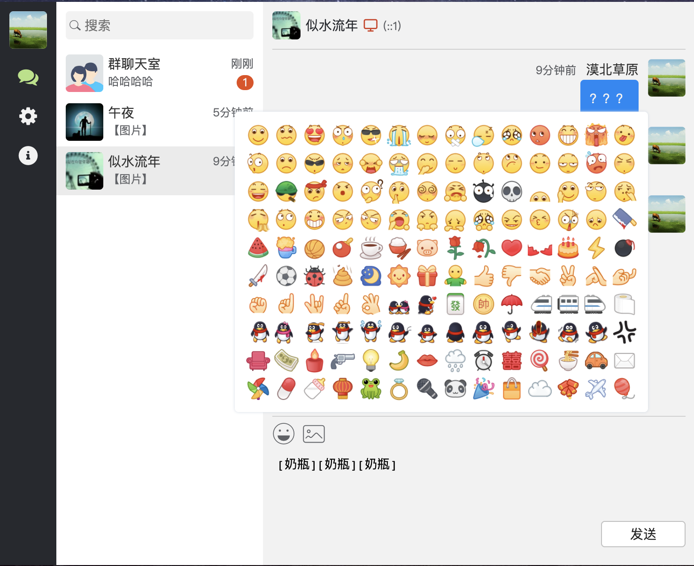

## 技术沟通群

WebChat聊天室
-------------

本家: https://github.com/cleverqin/node-websocket-Chatroom

功能介绍
--------

1. 在原项目基础上增加了注册退出等功能(后续还会完善更多功能上来)
2. 使用netty-socketio作为后端技术栈代替socket.io
3. 提供容器化支持

技术站点
--------

| 技术栈                                      | 版本                                               |
| ------------------------------------------- |--------------------------------------------------|
| socket.io-client(提供websocket客户端支持)   | 2.5.0(目前netty-socketio仅支持2.x版本的socket.io-client) |
| netty-socketio(socket.io的java语言服务端实现) | 1.7.22                                           |
| nodejs                                      | >= 12                                            |
| jdk                                         | >= 17                                            |
| springboot                                  | 3.0.0                                            |
| redisson                                    | 3.18.1                                           |

TODO LIST
---------

[✔]注册, 登录验证

[✔]退出登录

[✔]图片存储改成oss

[  ]创建群组

[  ]添加群组

使用手册
--------

1. 下载docker-compose.yml
2. 修改环境变量
3. 执行docker-compose up -d
4. 访问http://[ip:localhost]:[port:8888]

项目预览截图
------------

